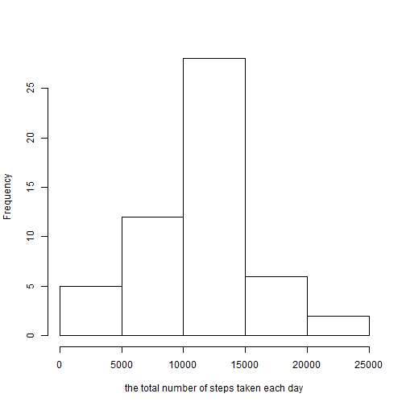
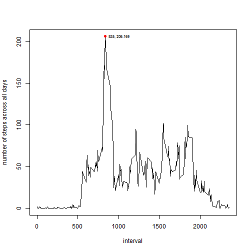
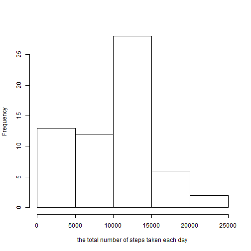
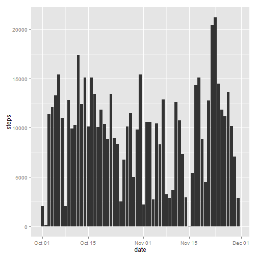
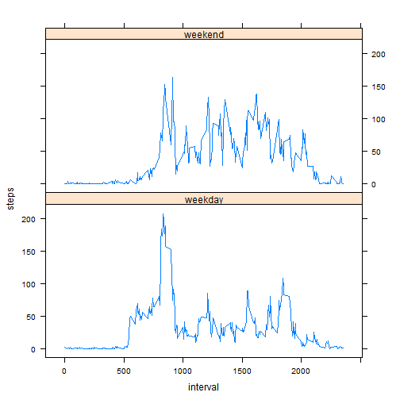

# Reproducible Research: Peer Assessment 1
by Anton

```r
library(knitr)
library(ggplot2)
library(lattice)
opts_chunk$set(echo = TRUE, results = "markup")
Sys.setlocale("LC_TIME", "English") # for weekdays in english
```

```
## [1] "English_United States.1252"
```
## Loading and preprocessing the data

```r
# file must be in your working directory
rdata <- read.csv("activity.csv", header = TRUE) # raw data
```

## What is mean total number of steps taken per day?
For this part of the assignment we ignore the missing values in the dataset.  

```r
# preprocessing the data
pdata <- subset(rdata, !is.na(rdata$steps))
smdata <- aggregate(steps~date, data=pdata, sum)
# creating a histogram
hist(smdata$steps, xlab = "the total number of steps taken each day", main = "")
```

 

```r
qplot(as.Date(date), steps, data = smdata, geom = "histogram", stat = "identity", xlab = "date")
```

 

The mean and median total number of steps taken per day:    

```r
mean(smdata$steps)
```

```
## [1] 10766
```

```r
median(smdata$steps)
```

```
## [1] 10765
```
## What is the average daily activity pattern?

```r
# preprocessing the data
mndata <- aggregate(steps~interval, data=pdata, mean)
plot(mndata$interval, mndata$steps, type = "l", xlab = "interval", ylab = "number of steps across all days")
# adding max point
p <- mndata[mndata$steps == max(mndata$steps),]
points(p, pch = 16, col = "red")
text(p, labels = substr(paste(p[1],p[2], sep = ", "),1,12), cex= 0.7, pos = 4)
```

 

On average across all the days in the dataset, 5-minute interval number 835 contains the maximum number of steps.    

## Imputing missing values  
For this part of the assignment we use raw data and filling in all of the missing values in the dataset.  
Calculating the total number of missing values in the dataset:   

```r
nrow(rdata[!complete.cases(rdata),])
```

```
## [1] 2304
```
The strategy for filling in all of the missing values in the dataset is set 5-minute interval of mising dates by 
median of same 5-minute interval in same weekdays.  

```r
misdates <- unique(as.Date(rdata[!complete.cases(rdata),2]))
misint <- unique(rdata[!complete.cases(rdata),3])
# create a full dataset that is equal to the original dataset but with the missing data filled in 
fdata <- rdata
for (i in 1:length(misdates)) {
        # searching same weekdays in preprocessed data and creating new data set with new values 
        nwdata <- pdata[weekdays(as.Date(pdata$date)) == weekdays(misdates[i]),] 
        nwdata <- aggregate(steps~interval, data=nwdata, median)
        fdata[as.Date(fdata$date) == misdates[i], "steps"] <- nwdata[, "steps"]                         
        }
```
Make a histogram of the total number of steps taken each day and Calculate and report the mean and median total number of steps taken per day

```r
smfdata <- aggregate(steps~date, data=fdata, sum)
hist(smfdata$steps, xlab = "the total number of steps taken each day", main = "")
```

 

```r
qplot(as.Date(date), steps, data = smfdata, geom = "histogram", stat = "identity", xlab = "date")
```

 

```r
mean(smfdata$steps)
```

```
## [1] 9705
```

```r
median(smfdata$steps)
```

```
## [1] 10395
```
With chosen "fill in strategy" the mean value decreased on ~10% and the median value less than 5% against the first part of the assignment.  

## Are there differences in activity patterns between weekdays and weekends?  


```r
wf <- numeric(0)
dates <- as.Date(fdata$date)
for (j in 1:length(dates)) {
        if (weekdays(dates[j]) %in% c("Sunday","Saturday")) wf <- c(wf,2)
        else wf <- c(wf,1)
}                 
fdata <- cbind(fdata, wf)
weekend <- aggregate(steps~interval, data=fdata[wf==2,], mean)
weekend$wf <- "weekend"
weekday <- aggregate(steps~interval, data=fdata[wf==1,], mean)
weekday$wf <- "weekday"
dfdata<-rbind(weekend,weekday)
dfdata <- transform(dfdata, wf = factor(wf))
xyplot(steps ~ interval | wf, data = dfdata, layout = c(1, 2), type = "l")
```

 
